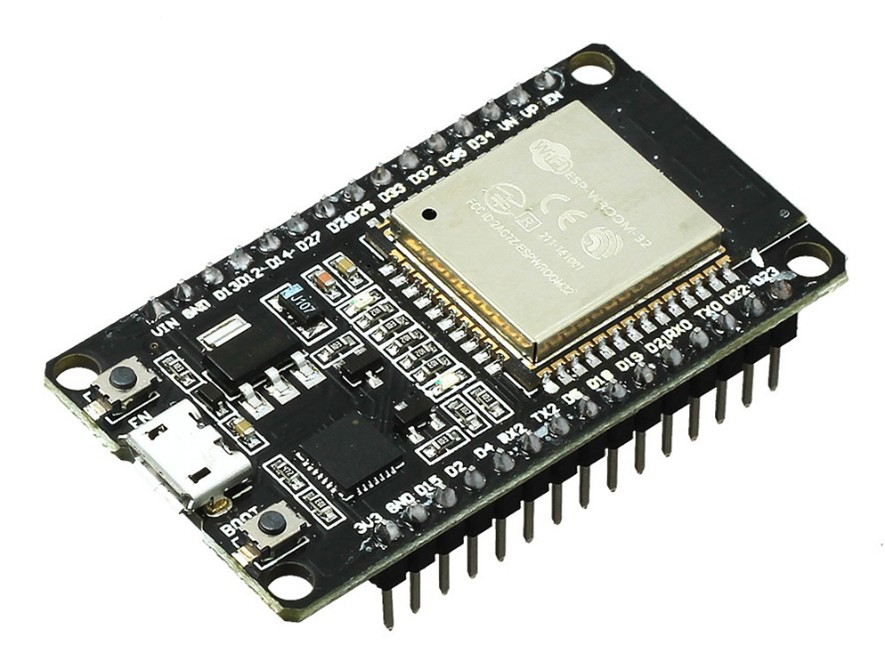
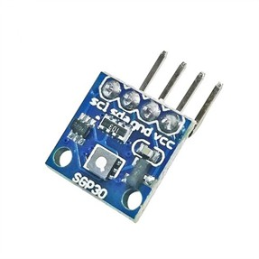
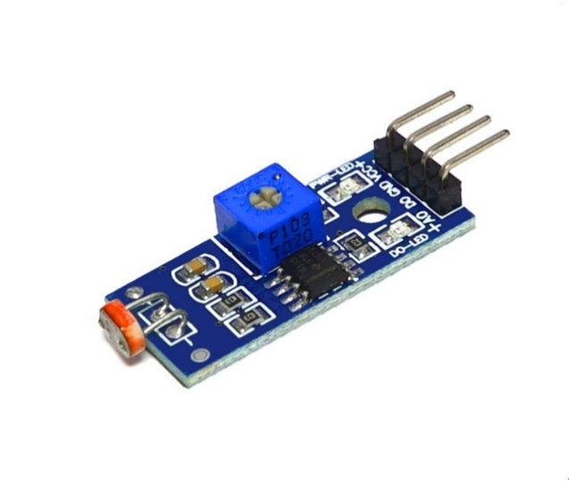
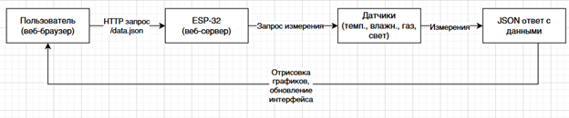
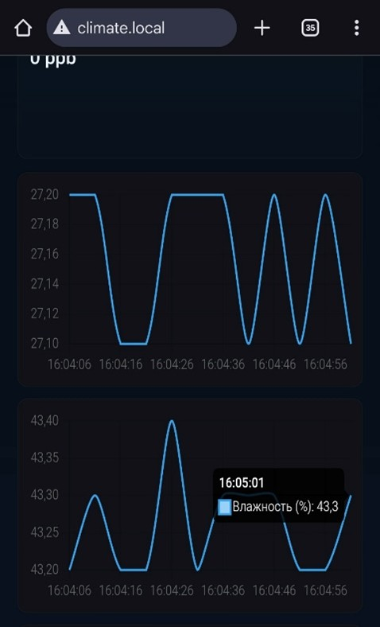

# Система мониторинга микроклимата на базе ESP32
Данный проект представляет собой систему мониторинга параметров микроклимата помещения, реализованную на базе микроконтроллера ESP32.

Система предназначена для измерения и отображения следующих параметров:
+ температура воздуха
+ относительная влажность
+ уровень освещенности
+ качество воздуха (CO₂ и TVOC)

Полученные данные обрабатываются микроконтроллером и отображаются через встроенный веб-интерфейс.

## Используемые компоненты
| Компонент | Назначение | Изображение |
|:----------|:-----------|:-----------:|
|ESP32-WROOM-32|Аппаратная платформа||
|DHT22|Датчик температуры и влажности||
|SGP30|Датчик качества воздуха||
|Модуль фоторезистора|Датчик освещенности||

## Используемые технологии
+ Среда разработки PlatformIO
+ Язык программирования C++
+ Файловая система [LittleFS](https://github.com/littlefs-project/littlefs)
+ HTTP сервер на базе микроконтроллера
+ [WiFiManager](https://github.com/tzapu/wifimanager)
+ multicast DNS (ESPmDNS)
+ JSON ([ArduinoJSON](https://github.com/bblanchon/ArduinoJson))

## Принцип работы
1. Микроконтроллер периодически считывает данные с подключенных датчиков
2. Данные обрабатываются и преобразуются в физические величины
3. Результаты передаются на встроенный веб-сервер
4. Пользователь получает доступ к данным через браузер

## Веб-интерфейс
На базе микроконтроллера запускается HTTP-сервер, позволяющий:
+ просматривать текущие показатели микроклимата в помещении
+ обновлять данные в реальном времени
+ получать доступ к системе через локальную сеть

## Скриншоты

## Результаты
В результате реализации проекта была создана система, позволяющая:
+ считывать параметры микроклимата в реальном времени
+ отображать данные через веб-интерфейс
+ использовать недорогую и доступную аппаратную платформу
